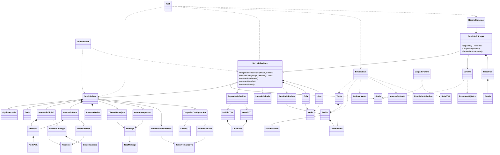

# UML de clases

Las flechas de composición indican datos propios de una instancia. Las dependencias unen las operaciones de las capas web, negocio, mensajería y persistencia.

```mermaid
classDiagram
class Web
class ConsolaSede
Web ..> ServicioSede
Web ..> ServicioPedidos
Web ..> Estadisticas
Web ..> HorarioEntregas
HorarioEntregas --> ServicioEntregas
ConsolaSede ..> ServicioSede
ConsolaSede ..> ServicioPedidos
ServicioEntregas --> ServicioPedidos
ServicioEntregas --> Dijkstra
ServicioEntregas *-- Recorrido
Recorrido *-- Parada
ServicioPedidos --> ServicioSede
ServicioPedidos --> Grafo
ServicioPedidos --> RepositorioPedidos
ServicioPedidos ..> LineaSolicitada
ServicioPedidos ..> ResultadoPedido
ResultadoPedido --> Pedido
ServicioPedidos *-- Cola
ServicioPedidos *-- Lista
Cola --> Nodo
Lista --> Nodo
Pedido --> EstadoPedido
Pedido *-- LineaPedido
Venta *-- LineaPedido
Venta ..> Pedido
ServicioSede --> OpcionesSede
ServicioSede *-- Sede
ServicioSede *-- InventarioGlobal
ServicioSede *-- InventarioLocal
ServicioSede *-- ReservaActiva
ServicioSede --> ClienteMensajeria
ServicioSede --> GestorRespuestas
GestorRespuestas --> Mensaje
ClienteMensajeria --> Mensaje
Mensaje --> TipoMensaje
InventarioLocal *-- ArbolAVL
InventarioGlobal *-- ArbolAVL
ArbolAVL *-- NodoAVL
InventarioLocal --> ItemInventario
InventarioGlobal --> EntradaCatalogo
ItemInventario --> Producto
EntradaCatalogo --> Producto
EntradaCatalogo *-- ExistenciaSede
ServicioSede --> RepositorioInventario
ServicioSede --> CargadorConfiguracion
CargadorConfiguracion ..> SedeDTO
CargadorConfiguracion ..> ItemInicialDTO
ItemInicialDTO --|> ItemInventarioDTO
RepositorioInventario ..> ItemInventarioDTO
RepositorioPedidos ..> PedidoDTO
RepositorioPedidos ..> VentaDTO
PedidoDTO *-- LineaDTO
VentaDTO *-- LineaDTO
CargadorGrafo ..> RutaDTO
CargadorGrafo ..> Grafo
Dijkstra ..> Grafo
Dijkstra ..> ResultadoDijkstra
Estadisticas ..> Venta
Estadisticas ..> Pedido
Estadisticas ..> Ordenamiento
Estadisticas ..> IngresoProducto
Estadisticas ..> RendimientoPedido
class ServicioEntregas {
  +Siguiente() Recorrido
  +Despachar(horario)
  +ReanudarAutomatica()
}
class ServicioPedidos {
  +RegistrarPedidoAsync(lineas, destino)
  +MarcarEntregado(id, minutos) Venta
  +ObtenerPendientes()
  +ObtenerHistorial()
  +ObtenerVentas()
}
```
